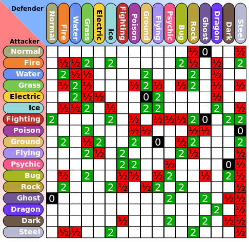

# PokeData
PokeData is a database and program that uses software engineering, data science, and artificial intelligence techniques to enhance strategy gameplay of Pokemon games.

Games I plan to cover:
Pokemon FireRed/LeafGreen (Currently)

Pokemon Ruby/Sapphire/Emerald

Pokemon Diamond/Pearl/Platinum

Pokemon HeartGold/SoulSilver

Pokemon Black/White/Black2/White2

As I'm in quarrantine, I will attempt to play though some Pokemon games and create a database and optimize strategies. I hope a completed tool will be helpful for Pokemon speedrunners and enthusiasts.

# Documentation 
I'm fairly new to SQL and JDBC... So this will be a bit messy for now and uncompleted. All the Java code is [here](src/PokeData) and the `.sql` file is [here](pokedata.sql).

## Creating the DataBase with MySQL
Database will be written in SQL (MySQL) and software will be written in Java. Java's OOP will optimize how Pokemon data is calculated.

JDBC will be the connector between the SQL database and Java. 

## Calculations with the `pokedata.sql` Database using Java and JDBC

### Implementing STAB (Same Type Attack Bonus)
Pokemon moves get an attack damage reward or penalty with accordance to its move type and defender's type.

## AI Functionality
Some artificially intelligent features I wish to implement once main interface is finished. Format Pokemon battles into gamestates and use game trees like minimax, expectimax, and alpha-beta pruning. 